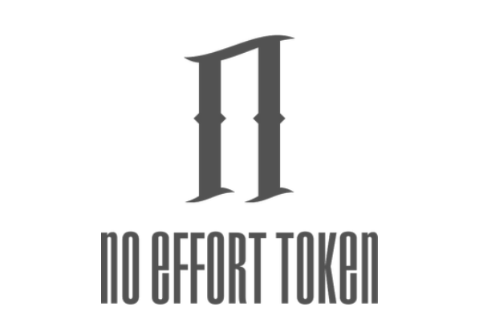

<html>
<title>W3.CSS Template</title>
<meta charset="UTF-8">
<meta name="viewport" content="width=device-width, initial-scale=1">
<link rel="stylesheet" href="https://www.w3schools.com/w3css/4/w3.css">
<link rel="stylesheet" href="https://fonts.googleapis.com/css?family=Lato">
<link rel="stylesheet" href="https://cdnjs.cloudflare.com/ajax/libs/font-awesome/4.7.0/css/font-awesome.min.css">

<body>

<!-- Navbar (sit on top) -->

  

    <a class="w3-bar-item w3-button w3-hover-black w3-hide-medium w3-hide-large w3-right" href="javascript:void(0);" onclick="toggleFunction()" title="Toggle Navigation Menu">
      <i class="fa fa-bars"></i>
    </a>
    <a href="#home" class="w3-bar-item w3-button">HOME</a>
    <a href="#about" class="w3-bar-item w3-button w3-hide-small">About</i></a>
    <a href="https://t.me/noefforttoken" class="w3-bar-item w3-button w3-hide-small">Telegram</i> </a>
    <a href="https://uniswap.info/home" class="w3-bar-item w3-button w3-hide-small">Uniswap</i> </a>
    
  

<!-- First Parallax Image with Logo Text -->

  

    NO EFFORT TOEKN (EFT)
  

<!-- Container (About Section) -->

  <h3 class="w3-center">What is No Effort Token?</h3>
  
NFT is... I don't even want to explain since it requires effort 😑. But here is a poem you can read.

    
Heart is draining

    
Feeling lost and cold

    
Where did my ETH go?

    
The ETH we had is now dull, forgotten

    
Do you even belive in moon or of my token?

    
Is something between us or lost the fomo?

    
For I still will moon

    
but a pajeet can only take so much

    
Moon shots cannot live on a one way street

    
The more I try to save it

    
The less I see effort come from you

    
It leaves me with all the weight and an empty heart.

    
It leaves me with all the weight and an empty heart.

    <!-- Hide this text on small devices -->
    

    

  

<!-- https://uniswap.info -->

  <h3 class="w3-center">How to buy?</h3>
  

    

      
    

    

      

      

      
You can buy the EFT on Uniswap using the button

      <form action="/action_page.php" target="_blank">
        

         <button onclick="location.href='https://uniswap.info' "class="w3-button w3-black w3-left w3-section" type="button">
            <i class="fa fa-paper-plane" ></i> Uniswap Buy
        </button>
      </form>
    

  

<h3 class="w3-center">Token Info</h3>

    

<!-- Footer -->
<footer class="w3-center w3-black w3-padding-64 w3-opacity w3-hover-opacity-off">
  <a href="#home" class="w3-button w3-light-grey"><i class="fa fa-arrow-up w3-margin-right"></i>To the top</a>
  

    
Disclaimer: This is not a financial product that guaranteed profit. The sole purpose of the NFT token is created for FUN!.

  

</footer>
 

</body>
</html>
